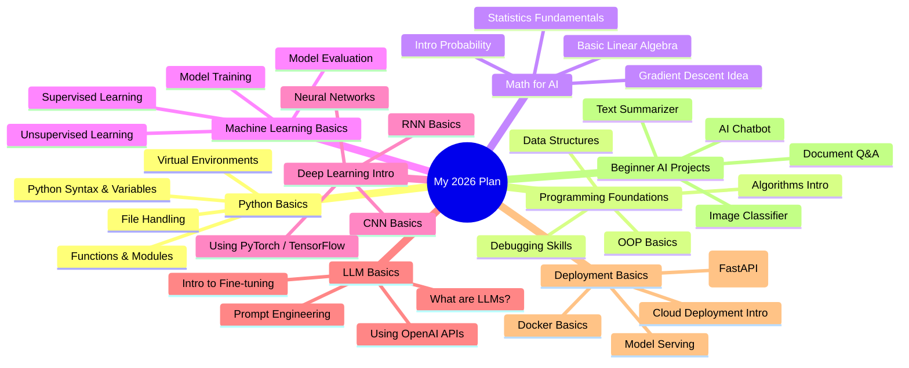

<!-- Snake Animation
<picture>
  <source media="(prefers-color-scheme: dark)" srcset="https://raw.githubusercontent.com/Sudo-Ali-Dev/sudo-ali-dev/main/dist/github-snake-dark.svg" />
  <source media="(prefers-color-scheme: light)" srcset="https://raw.githubusercontent.com/Sudo-Ali-Dev/sudo-ali-dev/main/dist/github-snake.svg" />
  
</picture>

3D Contribution Calendar
 -->