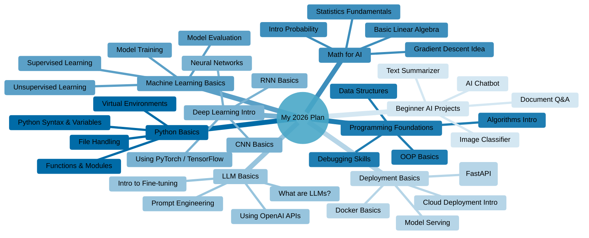

_If the diagram isn’t rendering, <a href="files/My-2026-Plan.svg">view it here</a>._

```mermaid
%%{init: {
  "theme": "base",
  "themeVariables": {
    "primaryTextColor": "#000000",
    "primaryColor": "#a9d6e5e3",


    "cScale0": "#006ba7",
    "cScale1": "#006ba7",
    "cScale2": "#1e7db2",
    "cScale3": "#3d8ebc",

    "cScale4": "#5ba0c7",
    "cScale5": "#79b2d2",
    "cScale6": "#97c4dd",
    "cScale7": "#b6d5e7",

    "cScale8": "#d4e7f2",
    "cScale9": "#2fffff",
    "cScale10": "#2fffff",
    "cScale11": "#2fffff"
  }
}}%%

mindmap
  root((My 2026 Plan))

    Python Basics
      Python Syntax & Variables
      Functions & Modules
      File Handling
      Virtual Environments

    Programming Foundations
      OOP Basics
      Data Structures
      Algorithms Intro
      Debugging Skills

    Math for AI
      Basic Linear Algebra
      Intro Probability
      Statistics Fundamentals
      Gradient Descent Idea

    Machine Learning Basics
      Supervised Learning
      Unsupervised Learning
      Model Training
      Model Evaluation

    Deep Learning Intro
      Neural Networks
      CNN Basics
      RNN Basics
      Using PyTorch / TensorFlow

    LLM Basics
      What are LLMs?
      Prompt Engineering
      Using OpenAI APIs
      Intro to Fine-tuning

    Deployment Basics
      Building APIs (FastAPI)
      Model Serving
      Docker Basics
      Cloud Deployment Intro

    Beginner AI Projects
      AI Chatbot
      Image Classifier
      Text Summarizer
      Document Q&A

```